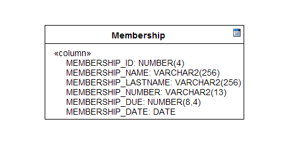
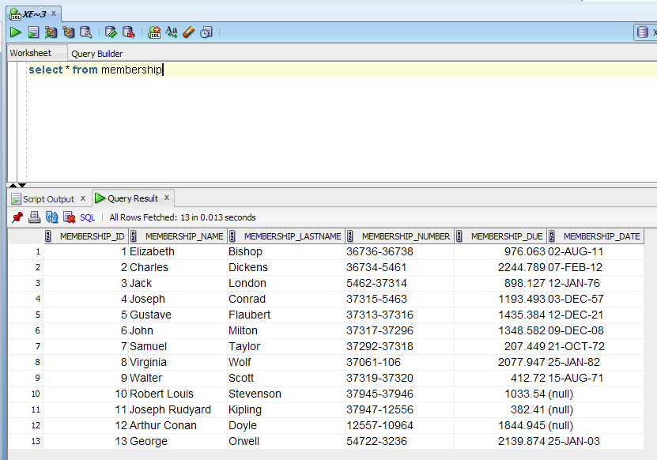
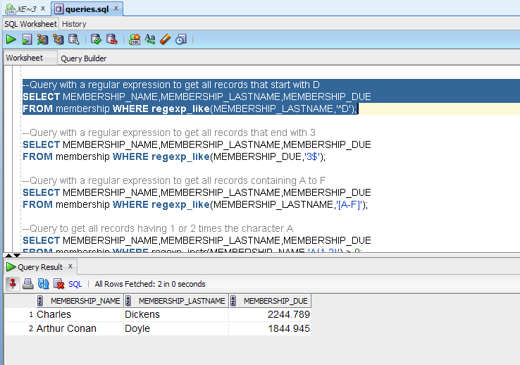
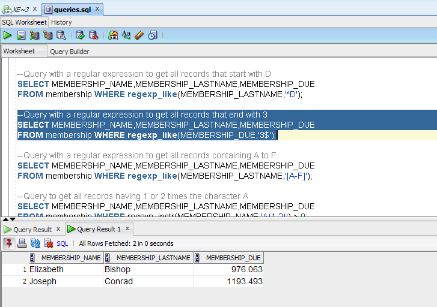
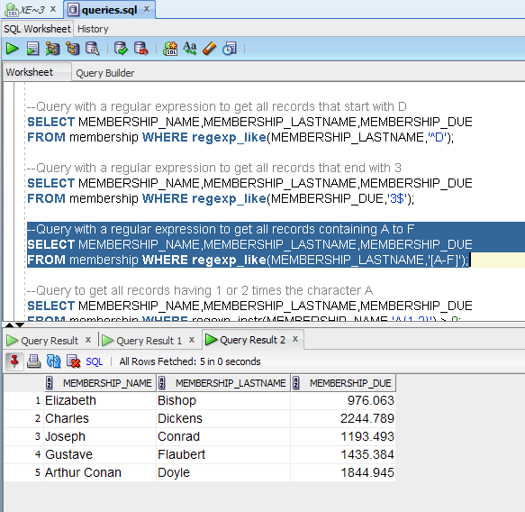
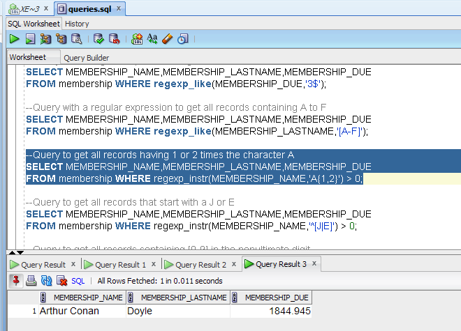
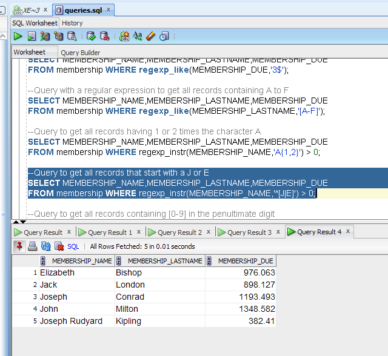
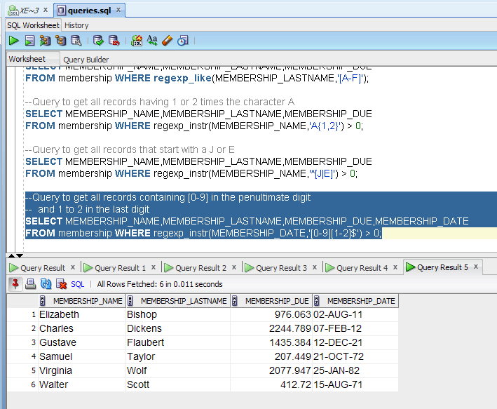

# Regular Expressions en PL/SQL Oracle, parte I

Una expresión regular (regular expression) es un conjunto de caracteres (signos) conocido como patrón que al buscarse coincide una o más veces en una cantidad considerable de texto, estos patrones se construyen con una notación de caracteres ordinarios y metacaracteres, los cuales tienen un significado especial dentro de la expresión regular e indican las reglas a las que deben someterse los caracteres ordinarios para su interpretación estos bloques básicos de construcción son similares a una expresión algebraica o a un mini lenguaje de programación.

A continuación algunos de los metacaracteres y su significado:
<ul>
<li><i>^</i>    coincide el patrón de búsqueda al inicio de una línea.</li>
<li><i>$</i>    coincide el patrón de búsqueda al final de una línea.</li>
<li><i>.</i>    coincide cualquier caracter en cualquier lugar. </li>
<li><i>[]</i>   especifica un rango de caracteres</li>
<li><i>?</i>    ubica un caracter opcional.</li>
<li><i>+</i>    ubica uno o más caracteres.</li>
<li><i>-</i>    ubica cero o más caracteres.</li>
<li><i>{n}</i>  ubica un caracter que aparece <i>n</i> veces.</li>
<li><i>{n,}</i> ubica un caracter que aparece n o más veces.</li>
<li><i>{n,m}</i>ubica un caracter que aparece de n a m veces.</li>
<li><i>|</i>    disyunción o sea un or lógico entre caracteres.</li>
</ul>

Las expresiones regulares son ampliamente utilizadas en Linux o en otros lenguajes Open Source, además de plataformas como Java y.NET y en bases de datos como PostgreSQL y Oracle.
En Oracle las expresiones regulares son utilizadas cada vez que necesites operaciones de búsqueda demasiado complicadas en donde los comandos <b>SELECT</b> y <b>LIKE</b> no sean suficientes.
Oracle tiene las siguientes cuatro funciones para su utilización:

<ul>
<li><b>REGEXP_LIKE:</b> es la versión de expresiones regulares del comando LIKE. Una función booleana que regresa TRUE,FALSE o NULL si en el texto existe una coincidencia con la expresión regular.</li>
<li><b>REGEXP_INSTR:</b> esta función regresa la posición del caracter  en el  texto donde se encontró una coincidencia con la expresión regular. </li>
<li><b>REGEXP_SUBSTR:</b> extrae una coincidencia de texto encontrada con la expresión regular.</li>
<li><b>REGEXP_REPLACE:</b> ejecuta una operación de búsqueda y reemplazo si se encuentra una coincidencia en el texto.</li>
</ul>

Utilizamos el <i>create_script.sql</i> para crear la siguiente tabla

 

Después insertamos los siguientes registros para comenzar a utilizar las funciones.

<pre>
Elizabeth  Bishop 36736-36738 976.063 02/08/1911
Charles Dickens 36734-5461 2244.789 07/02/1812
Jack London 5462-37314 898.127 12/01/1876
Joseph Conrad 37315-5463 1193.493 03/12/1857
Gustave Flaubert 37313-37316 1435.384 12/12/1821
John Milton 37317-37296 1348.582 09/12/1608
Samuel Taylor 37292-37318 207.449 21/10/1772
Virginia Wolf 37061-106 2077.947 25/01/1882
Walter  Scott 37319-37320 412.72 15/08/1771
Robert Louis  Stevenson 37945-37946 1033.54 13/11/1850
Joseph Rudyard  Kipling 37947-12556 382.41 30/12/1865
Arthur Conan Doyle 12557-10964 1844.945 22/05/1859
George  Orwell 54722-3236 2139.874 25/01/1903
</pre>

 

Como primer ejemplo utilizamos la función <b>REGEXP_LIKE</b> para obtener de la columna <i>MEMBERSHIP_LASTNAME</i>
los regitros que comienzan con la letra D.La consulta es:

<pre>
--Query with a regular expression to get all records that start with D
SELECT MEMBERSHIP_NAME,MEMBERSHIP_LASTNAME,MEMBERSHIP_DUE
FROM membership WHERE regexp_like(MEMBERSHIP_LASTNAME,'^D');
</pre>

 

 

Ahora utilizamos la función <b>REGEXP_LIKE</b> para obtener de la columna <i>MEMBERSHIP_DUE</i>
los regitros que terminan con el número 3.La consulta es:

<pre>
--Query with a regular expression to get all records that end with 3
SELECT MEMBERSHIP_NAME,MEMBERSHIP_LASTNAME,MEMBERSHIP_DUE
FROM membership WHERE regexp_like(MEMBERSHIP_DUE,'3$');
</pre>

 

 

Por último, utilizamos la función <b>REGEXP_LIKE</b> para obtener de la columna <i>MEMBERSHIP_LASTNAME</i>
los regitros que tengan las letras de la A a la F.  La consulta es:

<pre>
--Query with a regular expression to get all records containing A to F
SELECT MEMBERSHIP_NAME,MEMBERSHIP_LASTNAME,MEMBERSHIP_DUE
FROM membership WHERE regexp_like(MEMBERSHIP_LASTNAME,'[A-F]');
</pre>

 

 

Ahora ejemplos con la función <b>REGEXP_INSTR</b>. En el primer ejemplo
buscamos los registros que en la columna MEMBERSHIP_NAME 
tengan de 1 a 2 veces la letra A y cuyo posición de coincidencia del texto sea mayor 
    a 0.

<pre>
--Query to get all records having 1 or 2 times the character A 
SELECT MEMBERSHIP_NAME,MEMBERSHIP_LASTNAME,MEMBERSHIP_DUE
FROM membership WHERE regexp_instr(MEMBERSHIP_NAME,'A{1,2}') > 0;
</pre>

 

 

En este segundo ejemplo con <b>REGEXP_INSTR</b> buscamos todos los registros que en la columna 
    MEMBERSHIP_NAME comiencen con la letra J o la letra E.

<pre>
--Query to get all records that start with a J or E
SELECT MEMBERSHIP_NAME,MEMBERSHIP_LASTNAME,MEMBERSHIP_DUE
FROM membership WHERE regexp_instr(MEMBERSHIP_NAME,'^[J|E]') > 0;
</pre>

 

 

Un último ejemplo con <b>REGEXP_INSTR</b> buscamos todos los registros que en lacolumna MEMBERSHIP_DATE terminen en el penúltimo dígito del 0 al 9 y en el último dígito del 1 al 2.

<pre>
--Query to get all records containing [0-9] in the penultimate digit
--  and 1 to 2 in the last digit 
SELECT MEMBERSHIP_NAME,MEMBERSHIP_LASTNAME,MEMBERSHIP_DUE,MEMBERSHIP_DATE
FROM membership WHERE regexp_instr(MEMBERSHIP_DATE,'[0-9][1-2]$') > 0;
</pre>

 

<b>Estos ejemplos son para versiones 10.x o superior de Oracle.</b>

